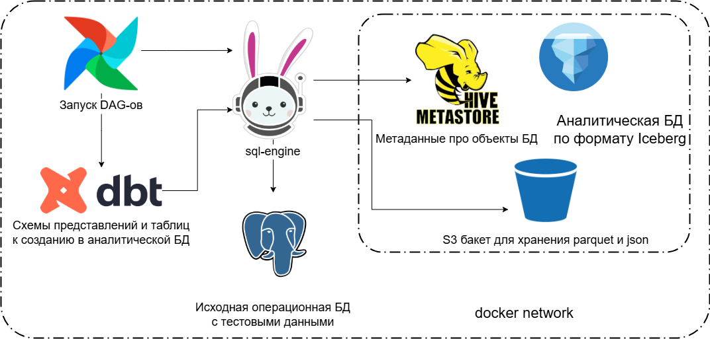

Демо-проект по работе с Apache Iceberg.
Для запуска проекта необходимо выполнить команду:

```docker-compose up -d```

При первом запуске необходимо развернуть дамп исходной "операционной" БД с тестовыми данными, а также создать бакеты для целевого аналитического хранилища в s3. Для этого выполнить команды (предполагается, что директория с файлом docker-compose.yml называется ice_demo):
- ```docker exec ice_demo-postgres-1 psql -U postgres -c "CREATE DATABASE co WITH OWNER postgres;"``` - создает "операционную" БД
- ```docker exec ice_demo-postgres-1 psql -U postgres -d co -f /home/codump.sql``` - заполняет БД тестовыми данными
- ```docker exec ice_demo-object-store-1 /bin/bash -c "mc alias set minio http://localhost:9000 minioadmin minioadmin && mc mb minio/ice && mc anonymous set public minio/ice && mc mb minio/source && mc anonymous set public minio/source"``` - создает бакеты для дальнейшего использования в Iceberg (на текущий момент в проекте используется только бакет source, поэтому можно не создавать ice)

Для входа в airflow необходимо использовать username = "admin" и password = значению, выведенному в логи контейнера ice_demo-airflow-1. Также сгенерированный пароль можно посмотреть в контейнере по пути "/root/airflow/standalone_admin_password.txt" (посмотреть с хоста можно так: ```docker exec ice_demo-airflow-1 cat /root/airflow/standalone_admin_password.txt```). Перед запуском DAG-ов необходимо настроить соединение с trino. Настройки соединения в веб-интерфейсе airflow/Admin/Connections/trino_default:
- host: sql-engine
- schema: iceberg
- port: 8080
- login: trino

Запуск DAG-ов:
- full_ice_loading - создает схему в Iceberg и мигрирует данные из "операционной" БД Postgres
- dbt_run_full - запускает создание всех моделей в dbt-проекте, а также все тесты
- dbt_run_marts - запускает модели marts + зависимости marts
- ice_teardown - очищает данные в Iceberg


